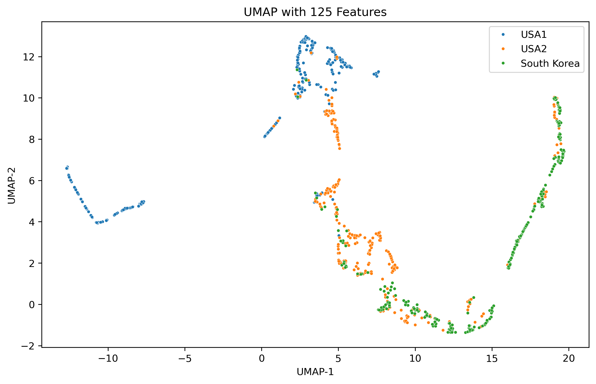
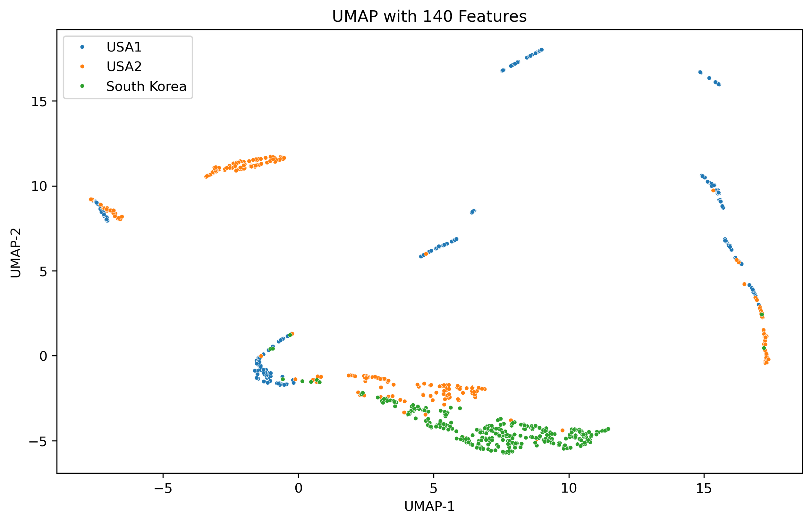
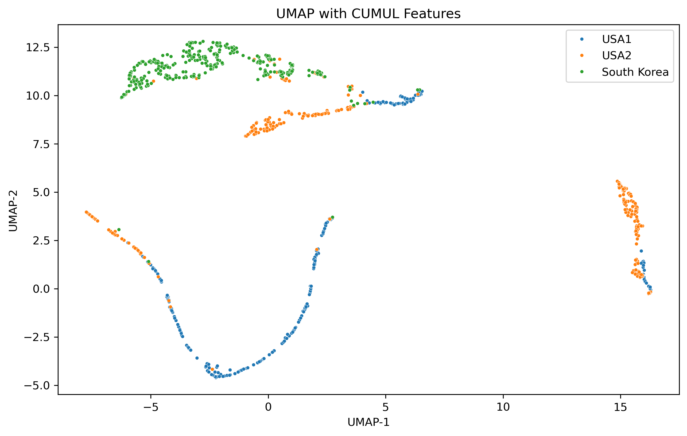
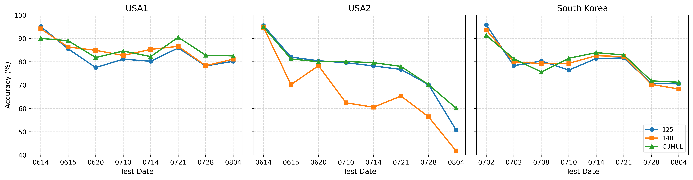
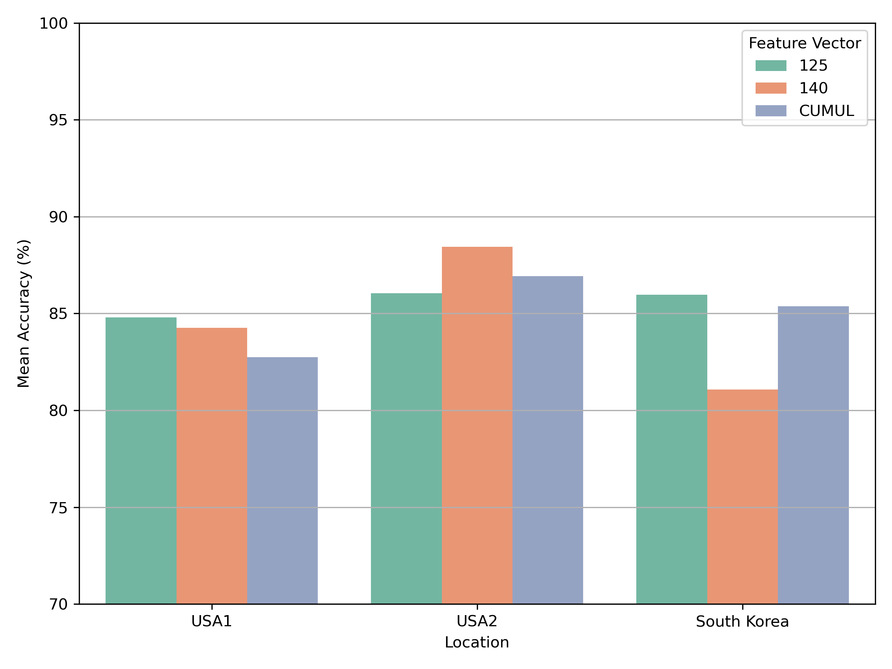
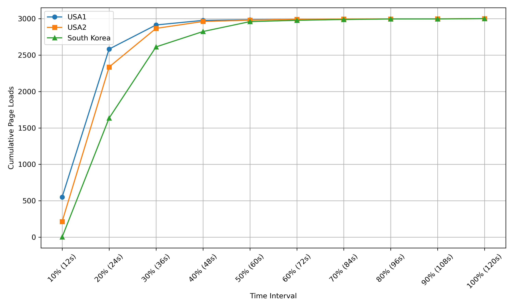
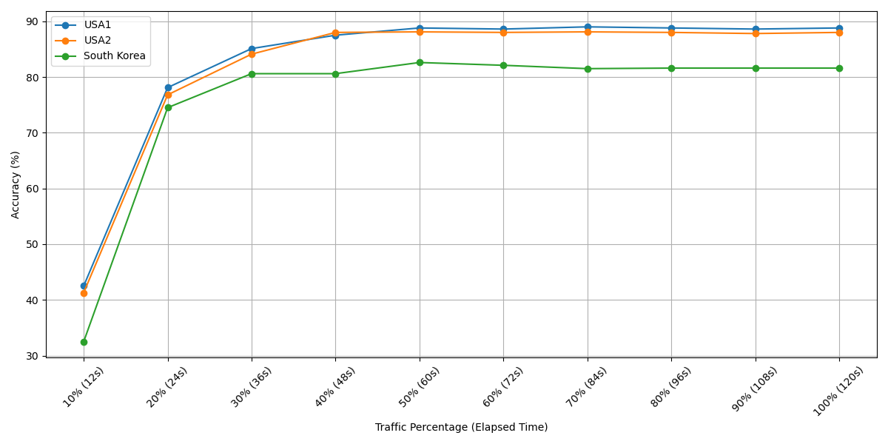

# 1. Pre-setting
### 1. Download the repository

```{shell}
download it at the top right of the site
```

### 2. Creating conda envs

```{shell}
conda create -n tor_analysis python=3.12
conda activate tor_analysis
```

### 3. Install requirements 

```{shell}
pip install -r requirements.txt
```

# 2. How to run

### 1. Experiment 1 (EX1): Impact of Geographical Variation on WF Accuracy

[1] Comparison of UMAP projections using 125 features, 140 features, and CUMUL features for traffic data from USA1, USA2, and South Korea (Figure 3)
> It shows results of whether there are close relations among the three regions, with significant overlap particularly between USA1 and USA2, which are geographically located within the same network domain. 
```{shell}
cd FIGURES
./fig3.sh
results are in FIGURES/fig_repository folder
```
<p align="center">
  
  
  
</p>

[2] Baseline: Same-location Training and Testing (Table 2) 
> The goal of this study is to evaluate how well the models perform when applied within the same location. To achieve this, we trained and tested the models using data collected from USA1, USA2, and South Korea.
```{shell}
cd ../EX1
./same_location.sh
cat ../results/EX1/same_location.txt
```
[3] Cross-location Testing: Train on One Location, Test on Another. (Table 3)
>The goal of this experiment is to evaluate how the model performs when applied to data from a different location, thereby assessing its generalizability across regions. To achieve this, the model is trained on data from one location, such as USA1, and then tested on data from another locations, such as USA2 and South Korea. Various combinations of training and testing locations are considered to comprehensively analyze the impact of geographic differences on model performance.
```{shell}
./cross_location.sh
cat ../results/EX1/cross_location.txt
```
[4] Mixed-location Training: Train on Multiple Locations, Test on One (Table 4)
>The goal of this experiment is to investigate whether model performance can be improved by incorporating training data from mixed locations, thus potentially enhancing generalizability. In this setting, the model is trained using data combined from multiple sources, such as USA1 and USA2, and then evaluated on a separate location (e.g., South Korea) or across all three locations. This approach aims to leverage diverse data distributions during training to mitigate the impact of domain shifts and improve robustness when deployed in different geographic contexts.
```{shell}
./mixed_location.sh
cat ../results/EX1/mixed_location.txt
```
&nbsp;

### 2. Experiment 2 (EX2): Temporal Drift and Its Effect on Model Performance
```{shell}
cd ../EX2
```
[1] Cross-Time Validation (Table 5)
>It shows a detailed analysis of cross-time testing, where models trained on data from Day 1 are tested on data collected after Day 2 and Day 6. The results clearly demonstrate that all feature vectors experience a drop in accuracy over time, highlighting the practical challenge of handling changing data distributions.
```{shell}
./cross_time.sh
cat ../results/EX2/cross_time.txt
```
[2] Reverse Cross-Time Validation (Table 6)
>It presents a detailed analysis of reverse cross-time testing, where models are trained on data from Day 6 and evaluated on data collected on Days 6, 2, and 1 across different locations.
```{shell}
./reverse_cross_time.sh
cat ../results/EX2/reverse_cross_time.txt
```
[3] Accumulate Robustness with Mixed Dates (Table 7)
>It shows how training with different temporal combinations, specifically Day 1 plus Day 6 compared to Day 2 plus Day 6, helps the model accumulate temporal knowledge and affects the final testing accuracy evaluated on Week 2 (Day 6).
```{shell}
./accumulate_robustness_with_mixed_dates.sh
cat ../results/EX2/accumulate_robustness_with_mixed_dates.txt
```
[4] Accuracy Over Time (Figure 4)
>it expands upon the temporal evaluation summarized in Table 5. Across all three geographic locations (USA1,USA2, and South Korea), the results demonstrate a clear pattern of performance degradation over time for every feature vector configuration.
```{shell}
cd ../FIGURES
./fig4.sh
result is in FIGURES/fig_repository folder
```
<p align="center">
  
</p>


[5] Mean Accuracy by Location and Feature Vector (Figure 5)
>it shows feature vector changes mainly introduce fine-tuning level adjustments, typically resulting in accuracy variations within the 3–4\% range. In contrast, location differences lead to much more substantial shifts in accuracy, driven by larger external factors such as network environment, traffic patterns, and user behavior
```{shell}
./fig5.sh
result is in FIGURES/fig_repository folder
```
<p align="center">
  
</p>
&nbsp;

### 3. Experiment 3 (EX3): Reexaming Partial-Trace Detection-is 30\% Really Enough?
```{shell}
cd ../EX3
```
[1] Accuracy vs Traffic Percentage (Elapsed Time)
>It presents a comparative analysis of the WTCM~\cite{deng2025countmamba} model's accuracy across three locations: USA1, USA2, and South Korea, as a function of traffic percentage observed over time.
```{shell}
./accuracy_vs_traffic_percentage.sh
cat ../results/EX3/accuracy_vs_traffic_percentage.txt
```
[2] Cumulative Page Loads over Time by Location (Figure 6)
>It illustrates the progression of completed page loads across three geographic locations—USA1, USA2, and South Korea—over ten time intervals corresponding to increasing percentages of page load completion, from 10 percent at 12 seconds to 100 percent at 120 seconds.
```{shell}
cd ../FIGURES
./fig6.sh
result is in FIGURES/fig_repository folder
```
<p align="center">
  
</p>

[3] Accuracy vs Traffic Percentage (Elapsed Time) Across Locations (Figure 7)
>It reveals that most onion service instances complete their page loading within approximately 36 seconds, with nearly all instances receiving the entirety of their traffic by 48 seconds.
```{shell}
./fig7.sh
result is in FIGURES/fig_repository folder
```
<p align="center">
  
</p>

